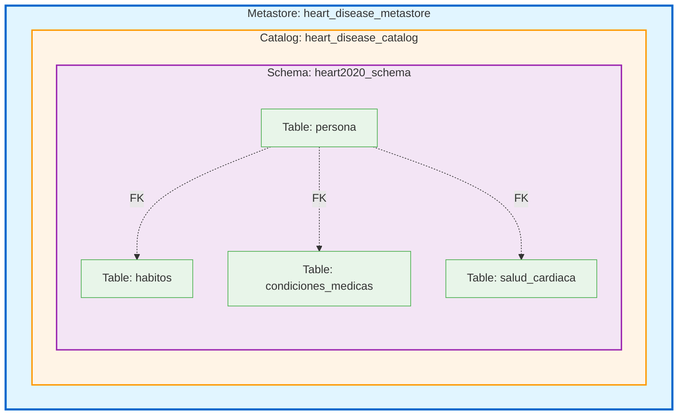
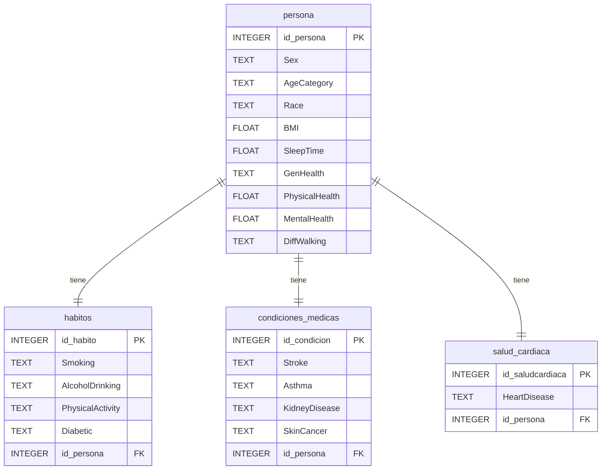
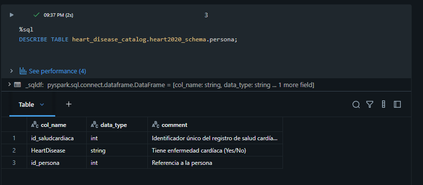
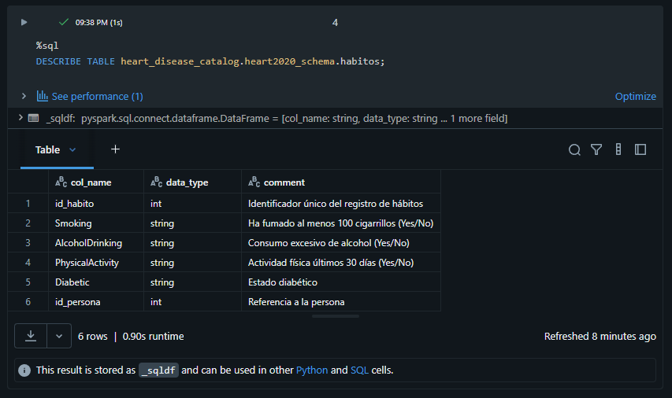
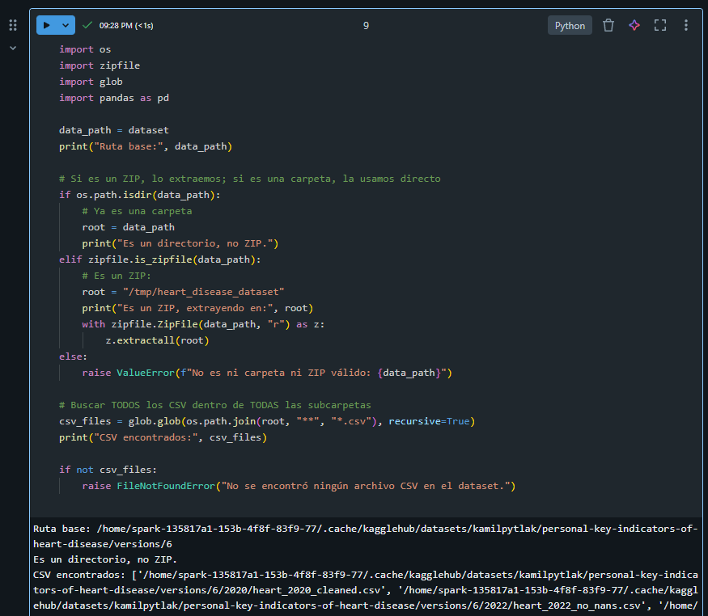
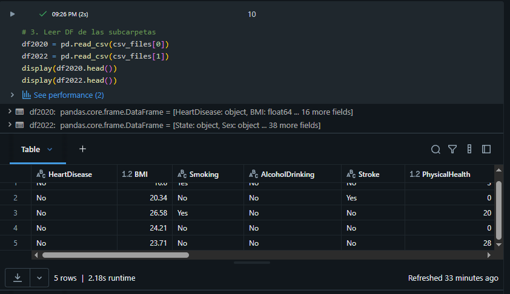
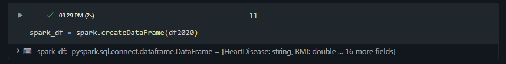
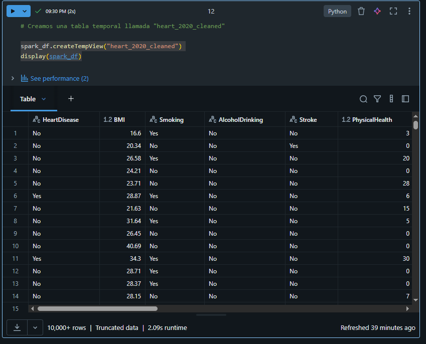

# **Big Data - Actividad 2: Heart Disease 2020 Dataset**

# 1- Descripción del Proyecto

Este proyecto implementa un modelo de base de datos normalizado para el análisis del dataset Heart Disease 2020, enfocado en factores de riesgo cardiovascular y características de salud de la población.

# 2- Estructura del Proyecto
```
bigdata_act_2/
├── README.md
├── doc/
│   ├── diccionario_datos.md    # Documentación completa del esquema
│   └── modelo.drawio            # Diagrama del modelo de datos
└── src/
    ├── schema_spark_sql.sql     # DDL en Spark SQL
    └── schema_pyspark.py        # StructType en PySpark
```
# 3- Diseño del Esquema de la Base de Datos

### 3.1 - Modelo de Datos (Unity Catalog)

El modelo sigue la jerarquía de Unity Catalog con 4 tablas en **3ra Forma Normal (3NF)**:

### 3.2 - Jerarquía de Objetos

#### 3.2.1. **Metastore** (Nivel Superior)

- **Nombre**: `heart_disease_metastore`
- **Propósito**: Contenedor de nivel superior para gobernanza centralizada

#### 3.2.2. **Catalog** (Segundo Nivel)

- **Nombre**: `heart_disease_catalog`
- **Propósito**: Agrupación lógica de schemas de salud cardiovascular

#### 3.2.3. **Schema** (Tercer Nivel)

- **Nombre**: `heart2020_schema`
- **Propósito**: Base de datos lógica con tablas del dataset 2020

#### 3.2.4. **Tables** (Cuarto Nivel)

1. **persona** - Datos demográficos y de salud general
2. **habitos** - Hábitos y estilo de vida
3. **condiciones_medicas** - Condiciones médicas preexistentes
4. **salud_cardiaca** - Información de salud cardiovascular

### Diagrama de Unity Catalog



### Diagrama Entidad-Relación



### 3.3 - Diccionario de Datos

Consulta [`doc/diccionario_datos.md`](doc/diccionario_datos.md) para:

- Arquitectura completa de Unity Catalog
- Descripción detallada de cada tabla y campo
- Tipos de datos y restricciones
- Relaciones entre tablas
- Diagramas Mermaid completos
- Configuración de gobernanza y permisos

## 4- Configuración de Cluster en Databricks

Para implementar este esquema en Databricks se elaboró un cluster siguiendo los pasos detallados en el documento [doc/creacion_cluster_databricks.md](doc/creacion_cluster_databricks.md).

## 5- Ingesta de datos desde Kaggle y Creación de tablas en Databricks usando SQL

Empleamos el siguiente DDL en Spark SQL para crear el catálogo, schema y tablas en Databricks Unity Catalog:

todo el siguiente código va en un notebook de Databricks con lenguaje SQL 

```SQL

%sql
-- ============================================================================
-- PASO 1: Crear el Catálogo (Catalog)
-- ============================================================================
CREATE CATALOG IF NOT EXISTS heart_disease_catalog
COMMENT 'Catálogo para análisis de salud cardiovascular y factores de riesgo';

-- Usar el catálogo creado
USE CATALOG heart_disease_catalog;

-- ============================================================================
-- PASO 2: Crear el Schema
-- ============================================================================
CREATE SCHEMA IF NOT EXISTS heart2020_schema
COMMENT 'Schema para dataset Heart Disease 2020 - CDC BRFSS'
WITH DBPROPERTIES (
    'project' = 'heart_disease_analysis',
    'dataset_year' = '2020',
    'source' = 'CDC_BRFSS',
    'created_by' = 'Jonathan Albués',
    'version' = '1.0'
);
````

Ver esquema completo en [`src/schema_spark_sql.sql`](src/schema_spark_sql.sql).

### 5.1 - Mostrar la descripción del esquema y las tablas creadas



--- 



--- 


## 5.2 - Obteniendo datos de kaggle

Se obtuvieron los datos del dataset Heart Disease 2020 desde Kaggle en el siguiente enlace:

`kamilpytlak/personal-key-indicators-of-heart-disease`

El código API de Kaggle se utilizó para descargar el dataset en formato ZIP y luego se extrajeron los archivos CSV para su posterior procesamiento.

En este caso el dataset contaba con dos carpetas internas, cada una con un archivo CSV diferente. En nuestro caso utilizamos el archivo `heart_2020_cleaned.csv` que se encontraba en la carpeta `2020`.



Usando pandas se cargó el archivo CSV y se realizó una inspección inicial de los datos para entender su estructura y contenido, usando `display()`:

```python
# 3. Leer DF de las subcarpetas
df2020 = pd.read_csv(csv_files[0])
df2022 = pd.read_csv(csv_files[1])
display(df2020.head())
display(df2022.head())
```



Luego usando Spark se cargaron los datos en un DataFrame de Spark para su posterior procesamiento y análisis:

```python
spark_df = spark.createDataFrame(df2020)
```



Finalmente se creó una tabla temporal llamada `heart_2020_cleaned`:

```python
spark_df.createTempView("heart_2020_cleaned")
display(spark_df)
```




# 6- Recursos Adicionales

