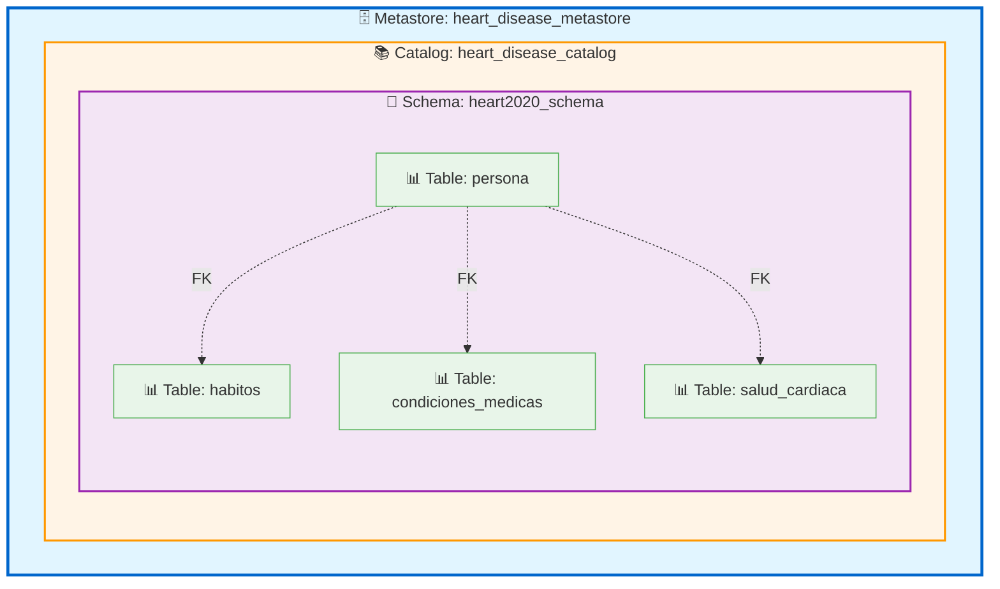
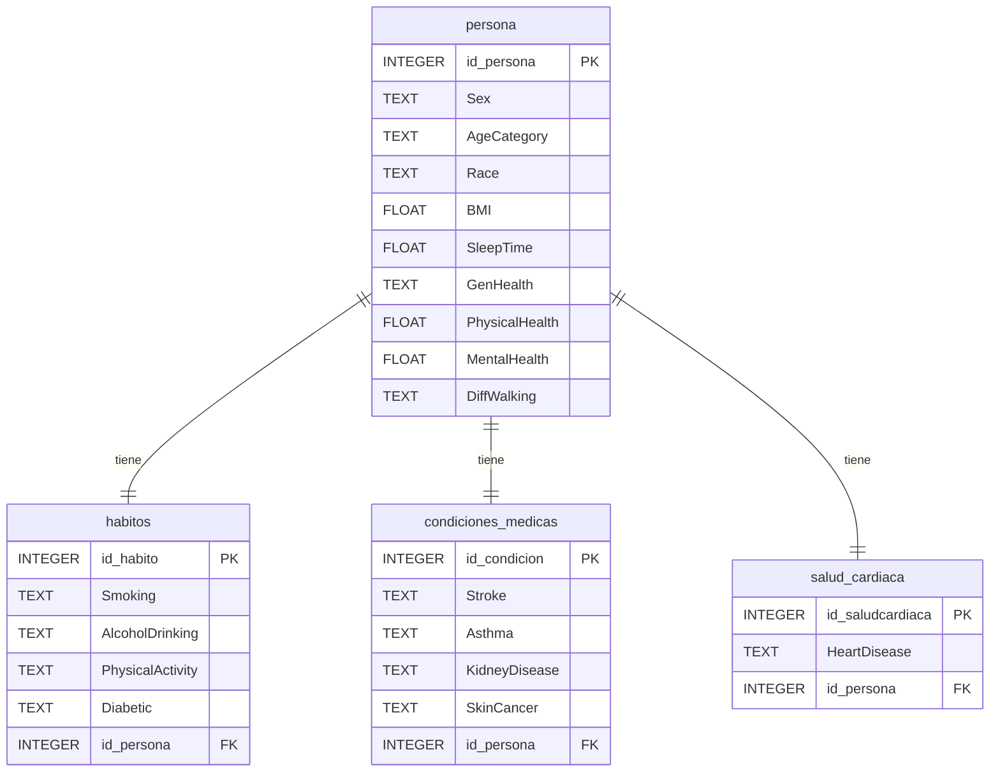

# Diccionario de Datos - Heart Disease 2020

## Modelo de Unity Catalog

## 1. Arquitectura del Catálogo de Unity (Unity Catalog)

Unity Catalog proporciona una jerarquía de objetos de datos de cuatro niveles para organizar y gobernar los datos:

```
Metastore
  └── Catalog (heart_disease_catalog)
       └── Schema (heart2020_schema)
            ├── Table: persona
            ├── Table: habitos
            ├── Table: condiciones_medicas
            └── Table: salud_cardiaca
```

### Jerarquía de Objetos

#### 1. **Metastore** (Nivel Superior)

- **Nombre**: `heart_disease_metastore`
- **Descripción**: Contenedor de nivel superior que almacena metadata de todos los catálogos
- **Ubicación**: Configurado a nivel de workspace de Databricks
- **Propósito**: Proporciona gobernanza centralizada y gestión de permisos

#### 2. **Catalog** (Segundo Nivel)

- **Nombre**: `heart_disease_catalog`
- **Descripción**: Agrupación lógica de schemas relacionados con análisis de salud cardíaca
- **Propietario**: Equipo de Data Engineering
- **Propósito**: Organizar todos los schemas relacionados con estudios de salud cardiovascular

#### 3. **Schema** (Tercer Nivel)

- **Nombre**: `heart2020_schema`
- **Descripción**: Base de datos lógica que contiene las tablas del dataset Heart Disease 2020
- **Ubicación**: `heart_disease_catalog.heart2020_schema`
- **Propósito**: Agrupar tablas relacionadas con el estudio de 2020

#### 4. **Tables** (Cuarto Nivel - Objetos de Datos)

Las tablas se organizan siguiendo un modelo normalizado (3NF):

- `persona` - Datos demográficos y de salud general
- `habitos` - Hábitos y estilo de vida
- `condiciones_medicas` - Condiciones médicas preexistentes
- `salud_cardiaca` - Información de salud cardiovascular

---

## 2. Diagrama de Unity Catalog



---

## 3. Nomenclatura Completa de Objetos (Three-Level Namespace)

En Unity Catalog, todos los objetos se referencian usando la notación de tres niveles:

```
<catalog>.<schema>.<table>
```

### Tablas del Proyecto

1. `heart_disease_catalog.heart2020_schema.persona`
2. `heart_disease_catalog.heart2020_schema.habitos`
3. `heart_disease_catalog.heart2020_schema.condiciones_medicas`
4. `heart_disease_catalog.heart2020_schema.salud_cardiaca`

---

## 4. Descripción de Entidades y Campos Clave

### Tabla: persona

**Nombre Completo**: `heart_disease_catalog.heart2020_schema.persona`

Almacena información demográfica y de salud general de cada persona.

| Campo          | Tipo de Dato | Descripción                                                      | Llave       | Nulabilidad |
| -------------- | ------------ | ---------------------------------------------------------------- | ----------- | ----------- |
| id_persona     | INTEGER      | Identificador único de la persona                                | PRIMARY KEY | NOT NULL    |
| Sex            | TEXT         | Sexo de la persona (Male/Female)                                 | -           | NULL        |
| AgeCategory    | TEXT         | Categoría de edad (ej: 18-24, 25-29, etc.)                       | -           | NULL        |
| Race           | TEXT         | Raza/Etnia de la persona                                         | -           | NULL        |
| BMI            | FLOAT        | Índice de Masa Corporal                                          | -           | NULL        |
| SleepTime      | FLOAT        | Horas promedio de sueño por día                                  | -           | NULL        |
| GenHealth      | TEXT         | Estado general de salud (Excellent, Very good, Good, Fair, Poor) | -           | NULL        |
| PhysicalHealth | FLOAT        | Número de días con mala salud física en los últimos 30 días      | -           | NULL        |
| MentalHealth   | FLOAT        | Número de días con mala salud mental en los últimos 30 días      | -           | NULL        |
| DiffWalking    | TEXT         | Dificultad para caminar o subir escaleras (Yes/No)               | -           | NULL        |

### Tabla: habitos

**Nombre Completo**: `heart_disease_catalog.heart2020_schema.habitos`

Almacena información sobre hábitos y estilo de vida.

| Campo            | Tipo de Dato | Descripción                                                                 | Llave       | Nulabilidad |
| ---------------- | ------------ | --------------------------------------------------------------------------- | ----------- | ----------- |
| id_habito        | INTEGER      | Identificador único del registro de hábitos                                 | PRIMARY KEY | NOT NULL    |
| Smoking          | TEXT         | Indica si la persona ha fumado al menos 100 cigarrillos en su vida (Yes/No) | -           | NULL        |
| AlcoholDrinking  | TEXT         | Indica consumo excesivo de alcohol (Yes/No)                                 | -           | NULL        |
| PhysicalActivity | TEXT         | Indica actividad física en los últimos 30 días (Yes/No)                     | -           | NULL        |
| Diabetic         | TEXT         | Estado diabético (Yes, No, No/borderline, Yes/during pregnancy)             | -           | NULL        |
| id_persona       | INTEGER      | Referencia a la persona                                                     | FOREIGN KEY | NULL        |

### Tabla: condiciones_medicas

**Nombre Completo**: `heart_disease_catalog.heart2020_schema.condiciones_medicas`

Almacena información sobre condiciones médicas preexistentes.

| Campo         | Tipo de Dato | Descripción                                      | Llave       | Nulabilidad |
| ------------- | ------------ | ------------------------------------------------ | ----------- | ----------- |
| id_condicion  | INTEGER      | Identificador único del registro de condiciones  | PRIMARY KEY | NOT NULL    |
| Stroke        | TEXT         | Indica si ha tenido un derrame cerebral (Yes/No) | -           | NULL        |
| Asthma        | TEXT         | Indica si tiene asma (Yes/No)                    | -           | NULL        |
| KidneyDisease | TEXT         | Indica si tiene enfermedad renal (Yes/No)        | -           | NULL        |
| SkinCancer    | TEXT         | Indica si tiene cáncer de piel (Yes/No)          | -           | NULL        |
| id_persona    | INTEGER      | Referencia a la persona                          | FOREIGN KEY | NULL        |

### Tabla: salud_cardiaca

**Nombre Completo**: `heart_disease_catalog.heart2020_schema.salud_cardiaca`

Almacena información específica sobre enfermedades cardíacas.

| Campo            | Tipo de Dato | Descripción                                        | Llave       | Nulabilidad |
| ---------------- | ------------ | -------------------------------------------------- | ----------- | ----------- |
| id_saludcardiaca | INTEGER      | Identificador único del registro de salud cardíaca | PRIMARY KEY | NOT NULL    |
| HeartDisease     | TEXT         | Indica si tiene enfermedad cardíaca (Yes/No)       | -           | NULL        |
| id_persona       | INTEGER      | Referencia a la persona                            | FOREIGN KEY | NULL        |

---

## 5. Relaciones entre Tablas

- **persona** (1) ← (1) **habitos**: Una persona tiene un registro de hábitos
- **persona** (1) ← (1) **condiciones_medicas**: Una persona tiene un registro de condiciones médicas
- **persona** (1) ← (1) **salud_cardiaca**: Una persona tiene un registro de salud cardíaca

---

## 6. Diagrama Entidad-Relación (Mermaid)



---

## 7. Gobernanza y Permisos en Unity Catalog

### Niveles de Permisos

Unity Catalog permite configurar permisos granulares en cada nivel:

| Nivel | Objeto    | Permisos Disponibles                   |
| ----- | --------- | -------------------------------------- |
| 1     | Metastore | CREATE CATALOG, USE CATALOG            |
| 2     | Catalog   | CREATE SCHEMA, USE CATALOG             |
| 3     | Schema    | CREATE TABLE, USE SCHEMA               |
| 4     | Table     | SELECT, INSERT, UPDATE, DELETE, MODIFY |

### Ejemplo de Permisos

```sql
-- Otorgar permisos de lectura en el catálogo
GRANT USE CATALOG ON CATALOG heart_disease_catalog TO `data_analysts`;

-- Otorgar permisos en el schema
GRANT USE SCHEMA ON SCHEMA heart_disease_catalog.heart2020_schema TO `data_analysts`;

-- Otorgar permisos de lectura en tablas específicas
GRANT SELECT ON TABLE heart_disease_catalog.heart2020_schema.persona TO `data_analysts`;
```

---

<!-- ## 8. Notas Adicionales

### Tipos de Datos

- **INTEGER**: Para identificadores y valores numéricos enteros
- **FLOAT**: Para valores numéricos con decimales (BMI, horas de sueño, días)
- **TEXT**: Para valores categóricos y de texto

### Consideraciones de Diseño

1. **Unity Catalog**: Arquitectura de cuatro niveles (Metastore → Catalog → Schema → Tables)
2. **Normalización**: El esquema está normalizado en tercera forma normal (3NF), separando datos demográficos, hábitos, condiciones médicas y salud cardíaca
3. **Integridad Referencial**: Todas las tablas relacionadas tienen llaves foráneas que referencian a `persona`
4. **Nulabilidad**: Actualmente todos los campos excepto las llaves primarias permiten valores NULL
5. **Formato Delta**: Todas las tablas usan formato Delta Lake para ACID compliance y time travel
6. **Gobernanza**: Unity Catalog proporciona control de acceso fino granular y linaje de datos automático

### Recomendaciones

- **Seguridad**: Implementar políticas de acceso basadas en roles (RBAC) usando Unity Catalog
- **Auditoría**: Aprovechar las capacidades de linaje de datos de Unity Catalog
- **Optimización**: Usar particionamiento en tablas grandes (ej: particionar `persona` por AgeCategory)
- **Validación**: Agregar restricciones CHECK para validar valores categóricos
- **Etiquetado**: Usar tags de Unity Catalog para clasificar datos sensibles (PII)
- **Versionado**: Aprovechar Delta Lake time travel para auditoría histórica -->
